<!-- Paleta: navy #0D1B3E · azul #60A5FA · lavanda #C7D2FE · sakura #F9A8D4 -->

<p align="center">
  
</p>

<p align="center">
  <a href="https://git.io/typing-svg">
    
  </a>
</p>

<p align="center">
  
  
  
  
</p>



##  `whoami`

```yaml
nombre:      Adrián Alejandro Serrato Flores
rol:         Tech Architecture Analyst @ Accenture México
formación:   Ingeniería en Software · FIME-UANL
creciendo:   Arquitectura de software 🏗️
me_apasiona: Análisis de datos 📊 · Astronomía 🔭
os_favorito: Fedora KDE 🐧
filosofía:   "La ingeniería es explotar la parte creadora de nosotros."
```

- 🏗️ Estoy desarrollando mis habilidades de **arquitecto de software**: diseñar sistemas que escalen, que se entiendan y que duren.
- 📊 Me interesa muchísimo el **análisis de datos**: encontrar la historia que hay detrás de los números.
- ☁️ Entré a Accenture por la **DevOps Academy**. Certificado **AZ-900**, ahora rumbo a **AZ-104**.
- 🤖 Explorando cómo orquestar **agentes de IA** que no solo organicen pendientes, sino que los resuelvan.
- 🧑‍🤝‍🧑 Fui **Coordinador General de GEITS**, el grupo estudiantil de Ingeniería en Software de FIME (~400 alumnos).


##  Stack

<p align="center">
  
  <br/><br/>
  
</p>


##  Proyectos destacados

<table>
  <tr>
    <td width="50%" valign="top">
      <h3>🔊 <a href="https://github.com/Batiburrillo-code/Voice-reader">Voice-reader</a></h3>
      Extensión de navegador tipo Speechify, <b>libre y sin servidores</b>. Lee páginas web y PDFs con voces neuronales offline (Piper) y resalta párrafo, oración y palabra en tiempo real.
      <br/><br/>
      
      
      
    </td>
    <td width="50%" valign="top">
      <h3>🍓 HomeLab</h3>
      NAS casero con Raspberry Pi, gestor de contraseñas autoalojado con <b>Vaultwarden</b> y planes de Pi-hole y servidor de Minecraft.
      <br/><br/>
      
      
      
    </td>
  </tr>
  <tr>
    <td width="50%" valign="top">
      <h3>🩺 MediTrack</h3>
      Proyecto de la DevOps Academy de Accenture.
      <br/><br/>
      
    </td>
    <td width="50%" valign="top">
      <h3>🤖 Agentes de IA</h3>
      Investigando cómo armar un equipo de agentes orquestados que ejecuten tareas reales, no solo que las organicen.
      <br/><br/>
      
      
    </td>
  </tr>
</table>


##  Estadísticas

<p align="center">
  
  
</p>

<p align="center">
  
</p>

<p align="center">
  
</p>


##  Fuera del código

<p align="center">
  🔭 <b>Astronomía</b> y física &nbsp;✦&nbsp; 📊 Datos que cuentan historias &nbsp;✦&nbsp; 🎵 Música &nbsp;✦&nbsp; ✍️ Escritura &nbsp;✦&nbsp; 🏋️ Gym y running
</p>

##  Ahora mismo

```text
Arquitectura de software      ▰▰▰▱▱▱▱▱▱▱   creciendo
AZ-104 Azure Administrator    ▰▰▰▱▱▱▱▱▱▱   en curso
Análisis de datos             ▰▰▱▱▱▱▱▱▱▱   explorando
Agentes de IA (LangGraph)     ▰▰▱▱▱▱▱▱▱▱   aprendiendo
```


<p align="center">
  <a href="https://www.linkedin.com/in/TU_USUARIO"></a>
  <a href="mailto:TU_CORREO"></a>
</p>

<p align="center"><i>✦ Crear para entender ✦</i></p>
